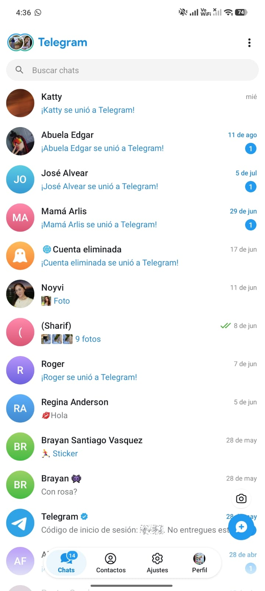
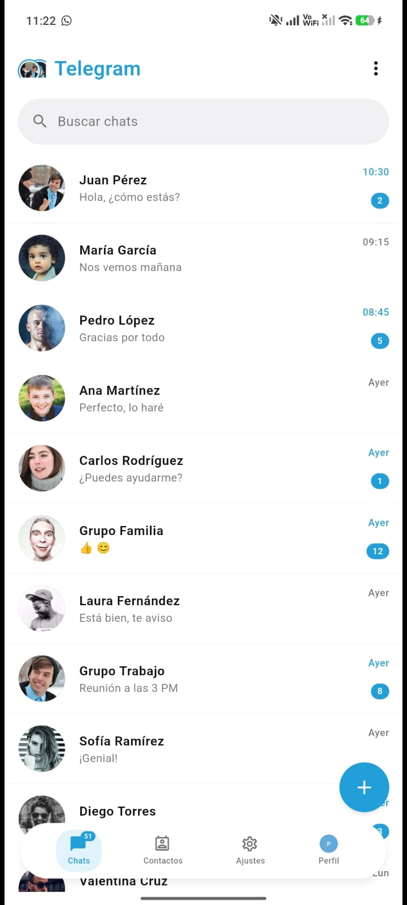

# Clon de Telegram - Pantalla de Chats

Clon estático de la pantalla principal de chats de Telegram

## Demo en Vivo

[Ver aplicación desplegada](https://melroj18.github.io/clonacionTelegram/)

## Comparación Visual

| Original (Telegram)                | Clon                            |
| ---------------------------------- | ------------------------------- |
|  |  |

## Widgets Utilizados

- Row / Column
- Stack + Positioned
- Expanded / Flexible
- Wrap
- CustomScrollView + SliverList

## Ejecutar Localmente

```bash
flutter pub get
flutter run -d chrome
```
